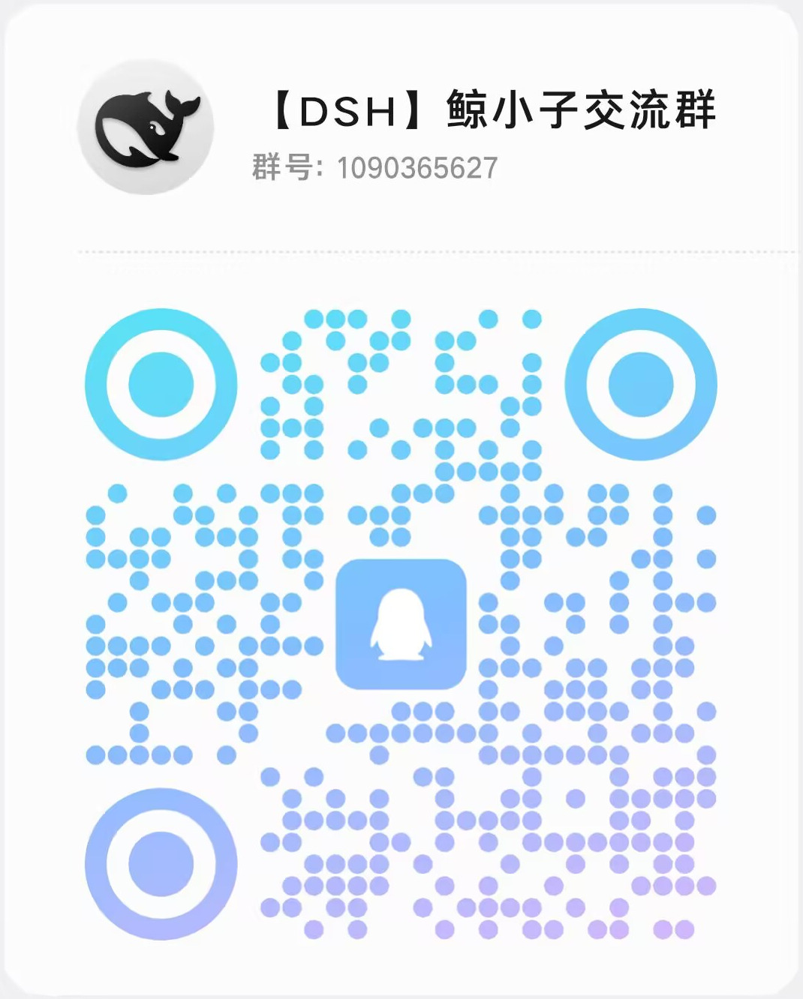

# dsh-wyymusic

[简体中文](README.md) | **English**

Adds a dedicated "NetEase Cloud Music" entry to the DeepSeek Harness sidebar. Open it and it **takes over the whole main area** with a purpose-built music player UI — not a TUI, not an external link, not a wrapper around the official client.

- Placement: sidebar `sidebar.panellist`, `order: -1` — listed **above** the built-in "Plugins" entry (= 0)
- Main area: registers a `wyymusic` page in the `main` slot; opening it replaces the main area entirely, and you can switch back to the chat at any time
- Music backend: **no CLI involved**. The host half talks to NetEase weapi/linuxapi/eapi directly; the browser half only calls same-origin routes on the host

Supported kernel: `@deepseek-ai/dsh` ≥ 0.1.7 (`sidebar.panellist` has been available since 0.1.7). Tested on 0.1.7-rc.2.

## Installation

Prerequisite: host kernel `@deepseek-ai/dsh` ≥ 0.1.7 (tested on 0.1.7-rc.2).
The package has zero runtime dependencies — `react` is a peer dependency and `@deepseek-ai/dsh-client-ui-slots` is injected by the host, so neither needs to be installed separately.

In the app's **Settings → Plugins**, paste an install source (or ask your agent to install it via `plugin_manager`), then **restart the app**
(the in-page injection manifest is fetched once when the host becomes ready; refreshing the page is not enough). Install specs the kernel accepts, with measured results:

| Install source | Resolved as | Notes |
| --- | --- | --- |
| `github:myYangyunfan/dsh-wyymusic` | git | `#branch/tag` supported |
| `https://github.com/myYangyunfan/dsh-wyymusic` | git | `#branch/tag` supported |
| `git+https://github.com/myYangyunfan/dsh-wyymusic.git` | git | |
| `dsh-wyymusic` | npm registry | **not published yet** — will 404 |
| `<absolute path>/dsh-wyymusic-0.2.0.tgz` | tarball | output of `npm pack`, see below |

> ⚠️ git sources are fetched by pnpm through `codeload.github.com`. Measured on **this** machine that path is blocked (`github.com`'s git protocol works; `codeload` times out after 20s),
> so on this machine install from the tarball: `npm pack` to produce `dsh-wyymusic-0.2.0.tgz`, then paste its **absolute path** into the plugin page. On machines where codeload is reachable, all three git forms work.

### Local development: linking the repo

Changes take effect immediately without reinstalling (used for development on this machine). Link the repo into the profile's `node_modules`:

```sh
node -e "require('fs').symlinkSync(require('node:path').resolve('.'), process.env.USERPROFILE + '/.dsh/profiles/desktop/node_modules/dsh-wyymusic','junction')"
```

Then add the package name to `dsh.profile.bundles` in `~/.dsh/profiles/desktop/package.json` and restart the app.

> ⚠️ That profile is `nodeLinker: hoisted` and its `dependencies` hold only `@dsh-pack/all`: **the next time you install or remove anything from the plugin page, pnpm prunes `node_modules` entries that aren't in the dependency graph** and cuts the junction — the symptom is the entry disappearing after a restart; just re-run the command above.

> ⚠️ Re-installing a `.tgz` that **overwrites the same path** makes pnpm report `Already up to date` — it does not refresh (measured: `pnpm remove dsh-wyymusic` first, then add). A new version number is a new path and is unaffected.

> The official Harness kernel is packed inside `resources/app.asar` and runs in the Electron main process. It listens on no local port, so you cannot curl it to verify; to run it standalone for verification, see "Self-checks" below.

## Layout

| Half | File | Responsibility |
| --- | --- | --- |
| Host | `lib/index.js` | `/wyymusic/*` routes, login persistence, upstream proxy, audio stream proxy |
| Host | `lib/netease.js` | NetEase API layer (ported from the MIT-licensed `dsh-music-player`; see `LICENSE.dsh-music-player.txt`) |
| Host | `lib/yrc.js` | Word-by-word (YRC) lyric parser |
| Host | `lib/fetch-limit.js` | Concurrency / rate limiting |
| Client | `lib/client.js` | Sidebar icon + full-screen GUI (discover / charts / my playlists / search / player bar / lyrics) |
| Client | `lib/vendor/qrcode.mjs` | QR code for scan login |

Two more trees live in the repo: `design/` (prototype `proto.html` + visual plan UI-PLAN.md + gap ledger UI-GAP-LEDGER.md +
ambient architecture AMBIENT.md + `shots/` screenshot evidence) and `scripts/` (four self-check legs + the one-off probe `probe-seek.mjs`).

`dsh.plugin.json` / `cordis.patch.yml` form the self-loading declaration: the package inserts its own `dsh-wyymusic` line into the loader — it does **not** write into the profile's patch layer.

## Host routes

All registered on `webServer` under `prefix: /wyymusic` — same-origin, no CORS.

| Route | Method | Description |
| --- | --- | --- |
| `/wyymusic/api/status` | GET | Login state (`loggedIn` / `userId` / `nickname` / `vipType`) |
| `/wyymusic/api/qr` | GET | Fetch a key for the scan-login QR code |
| `/wyymusic/api/qr/check` | GET | Poll the scan result; persists to disk on success |
| `/wyymusic/api/import-musicfox` | POST | One-click import from go-musicfox's cookie jar (no second QR scan) |
| `/wyymusic/api/logout` | POST | Clear login state |
| `/wyymusic/api/search` | GET | Search songs / playlists / artists |
| `/wyymusic/api/toplists` | GET | Chart list |
| `/wyymusic/api/toplist/songs` | GET | Tracks in a chart |
| `/wyymusic/api/recommend` | GET | Recommended playlists |
| `/wyymusic/api/categories` | GET | Playlist category tags |
| `/wyymusic/api/category/playlists` | GET | Playlists under a category |
| `/wyymusic/api/playlist` | GET | Playlist detail |
| `/wyymusic/api/playlist/subscribe` | POST | Subscribe / unsubscribe a playlist |
| `/wyymusic/api/myplaylists` | GET | My playlists |
| `/wyymusic/api/lyric` | GET | Lyrics (including word-by-word YRC) |
| `/wyymusic/api/songurl` | GET | Resolve the playback URL (returns the same-origin `/wyymusic/stream?id=`; the upstream CDN is never exposed) |
| `/wyymusic/api/prefs` | GET / POST | UI preferences: language, recently played, **ambient settings** (POST merges partially; every numeric field is clamped) |
| `/wyymusic/stream` | GET | Audio stream proxy (fetches with cookie, then streams out) |
| anything else | * | `404 {ok:false,error:"not found"}` |

## Ambient mode (breaking out of the plugin panel)

A song's mood can spill onto the chat UI **outside the plugin panel**. The entry point is at the **bottom of the music page's left rail**: two quick toggles
(ambient backdrop / beat bars) plus a master settings button.

| Effect | What it is | Where it's mounted |
| --- | --- | --- |
| Ambient backdrop | the **full-screen lyric backdrop** (blurred cover + color-graded floor) at 60% opacity, laid at the very **bottom** of the chat UI; position is migrated, colors unchanged | the host frame's **first child** (below all columns, showing through the transparent chat column) |
| Spotlights | two **Tyndall light beams**, top-left / top-right, each tilted toward screen center, swaying with the beat + flashing (the chat UI lights up too) | same as above |
| Beat bars | 72 spectrum bars (56px tall by default) along the bottom of the chat column, bouncing with the audio; the whole strip breathes on downbeats with a glowing bottom edge | same as above |
| Typing notes | typing in the composer pops a small note above-right of the caret; it disappears on its own after 760ms | same as above (document-level, read-only input observation) |
| Settings pulse | every toggle in the ambient settings page sways left-right + flashes with the beat | inside the settings panel (`--amb-beat` written by rAF) |

A permanent **playback diagnostics** line sits at the bottom of the settings panel (`rs` / `range` / the last seek result) — for problems like "clicking the progress bar doesn't jump" that only show up on someone else's machine, that line is the scene report.

Key point: these effects mount on the host's **`shell.overlay`**, not `main` — the latter is unmounted when you switch to the chat view, so mounting there would mean "gone the moment you leave the music page". Settings persist in the `ambient` field of `prefs.json` (the same file as language / recently played).

Cost: one slowly drifting cover + 72 bars (measured: 77 DOM nodes), **transform-only writes**, no canvas, no `filter: blur()`; 30fps while playing,
12.5fps when paused, 0 frames when the master switch is off. Audio analysis is a **read-only tap** through `captureStream() + AnalyserNode`
(not connected to destination; does not affect what you hear). Architecture, measured host-side pitfalls and item-by-item disproofs: [`design/AMBIENT.md`](design/AMBIENT.md).

## Login state

Stored at `$DSH_HOME/wyymusic/cookie.json` (mode `0600`). Two ways to obtain it: scan the QR code, or import from go-musicfox's cookie jar (on Windows: `%LOCALAPPDATA%\go-musicfox\cookie`). **The cookie is used only on this machine and is never uploaded anywhere.**

## Self-checks

```sh
node scripts/i18n-check.mjs        # static guard: no Chinese literals outside the table; STR tables must have both columns
node scripts/smoke-host.mjs        # host half: hits the real NetEase API (18 checks)
node scripts/smoke-client.mjs      # client half: real rendering in jsdom (48 checks, incl. ambient switches and disproofs)
node scripts/harness-ambient.mjs   # ambient: real kernel + real browser + real audio + motion oracle + real click-to-seek (61 checks, 4 screenshots)
```

Equivalent to `npm run i18n` / `smoke:host` / `smoke:client` / `harness`. When chasing problems that only appear on a real machine
(like "clicking the progress bar doesn't jump"), use `node scripts/probe-seek.mjs` (a one-off probe: prints observations, asserts nothing).

How the last two divide the work: jsdom has no audio / layout / compositor, so it can only prove wiring and toggles; `harness-ambient` extracts the
kernel tree and runs it in `web` mode (isolated `DSH_HOME`, read-only cookie copy) to verify "it really moves with real music, and keeps moving after you
switch to the chat view". Prerequisites and pitfalls are in that script's header comment.

## Compliance

⚠️ Unofficial APIs are used and copyrighted music is streamed — **for personal listening / study only**. This violates the platform's ToS; you bear the risk, including any account risk-control consequences. **Grey-song unlocking / circumventing copyright restrictions is strictly forbidden.**

For personal study and use only — please support the official releases.

## License

The project's own code (`lib/index.js`, `lib/client.js`, `scripts/`, `design/`, …) is open source under **Apache-2.0** —
full text in [`LICENSE`](LICENSE), copyright attribution in [`NOTICE`](NOTICE).

The ported "NetEase API access layer" files (`lib/netease.js` / `lib/yrc.js` / `lib/fetch-limit.js` /
`lib/vendor/qrcode.mjs`) remain under their original **MIT** license; provenance and copyright are itemized in
[`THIRD_PARTY_NOTICES.md`](THIRD_PARTY_NOTICES.md). Apache-2.0 permits including MIT code; the license of those files is not replaced.

## Community

Stuck on install, found a bug, or want a feature? Join the QQ group (group no. **1090365627**) — or just open an [issue](https://github.com/myYangyunfan/dsh-wyymusic/issues).

